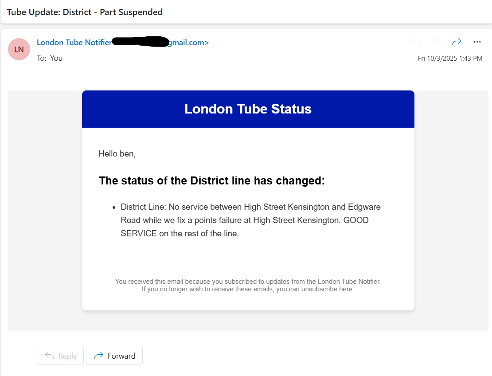

# 🚇 London Tube Notifier

## TL;DR

Real-time London transport tracker: Tube, DLR, Overground, Elizabeth line, and Tram.  
Online users get instant SignalR notifications; offline users get emails.  
Built with .NET 8, React, EF Core, and in-memory caching for performance.

---

London Tube Notifier is a full-stack app that tracks Tube, DLR, Overground, Elizabeth line, and Tram in real time.  
Users can subscribe to their favourite lines and get alerts the moment something changes.

If they’re **online in the app**, updates arrive instantly through **SignalR push notifications**.  
If they’re **offline**, they won’t miss out — the system automatically sends them an **email notification** instead using **SendGrid**.

On the homepage, the list of tube lines is always in sync with the backend. It doesn’t hammer the database either, because it’s backed by a cached line service.

---

## What it does

- **Live updates**: Tube line statuses update in real time, no refresh needed.
- **Smart notifications**:
  - Online → SignalR push
  - Offline → Email fallback
- **Smart notifications**: Visual alerts with colors and icons depending on severity (minor, moderate, severe).
- **Efficient**: Cached data means the DB isn’t hit on every request.
- **Secure**: JWT authentication and user management with subscriptions.

---

## Tech Stack

| Area          | Tech                                                                  |
| ------------- | --------------------------------------------------------------------- |
| Frontend      | React (TypeScript), TailwindCSS, Axios, React Router, React Hot Toast |
| Backend       | .NET 8 Web API, SignalR, ASP.NET Identity, EF Core, SQL Server        |
| Notifications | SignalR (real-time) + SendGrid (Email fallback)                       |
| Auth          | JWT access & refresh tokens                                           |
| Performance   | In-memory caching for line data                                       |

---

## Architecture

The project follows **Clean Architecture**, split into three main layers:

- **Core** (Domain + Application together): business rules, entities, services.
- **Infrastructure**: database with EF Core, cached repositories, email delivery, TfL API client.
- **Web API**: exposes endpoints, handles SignalR connections.
- **Frontend**: React client that stays in sync with backend through SignalR.

---

## How it works

1. A background worker polls the **TfL API** at intervals.
2. New statuses are compared with cached ones.
3. If something changes:
   - Users online in the app get an **instant SignalR push**.
   - Offline users get an **email notification** via a background job.
4. The React app’s homepage list is **kept in sync** with SignalR messages — no extra DB hits thanks to cached data.

---

## Screenshots

  

    
    
Homepage

  

  

    
    
Subscriptions Page

  

  

    
    
Notification via SignalR

  

  

    
    
Email Notification

  

  

